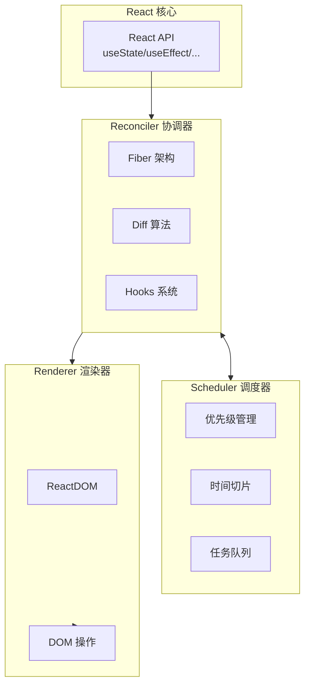
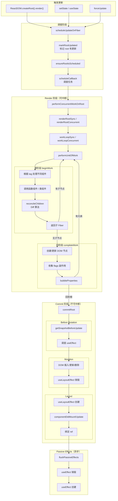
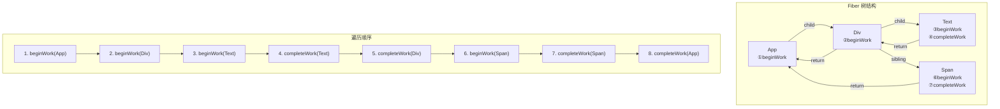
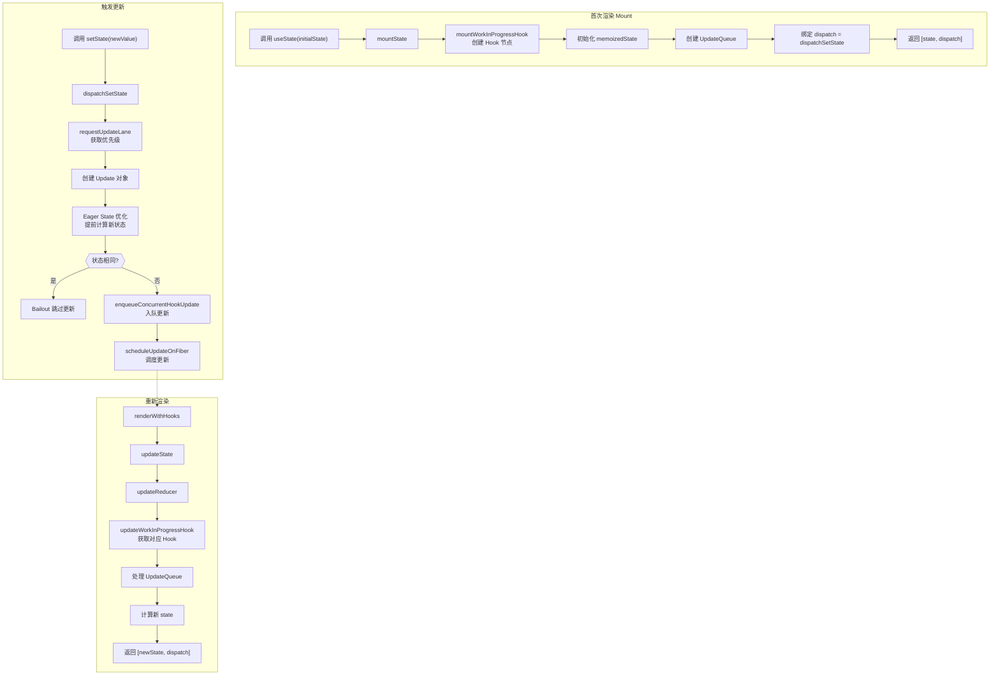
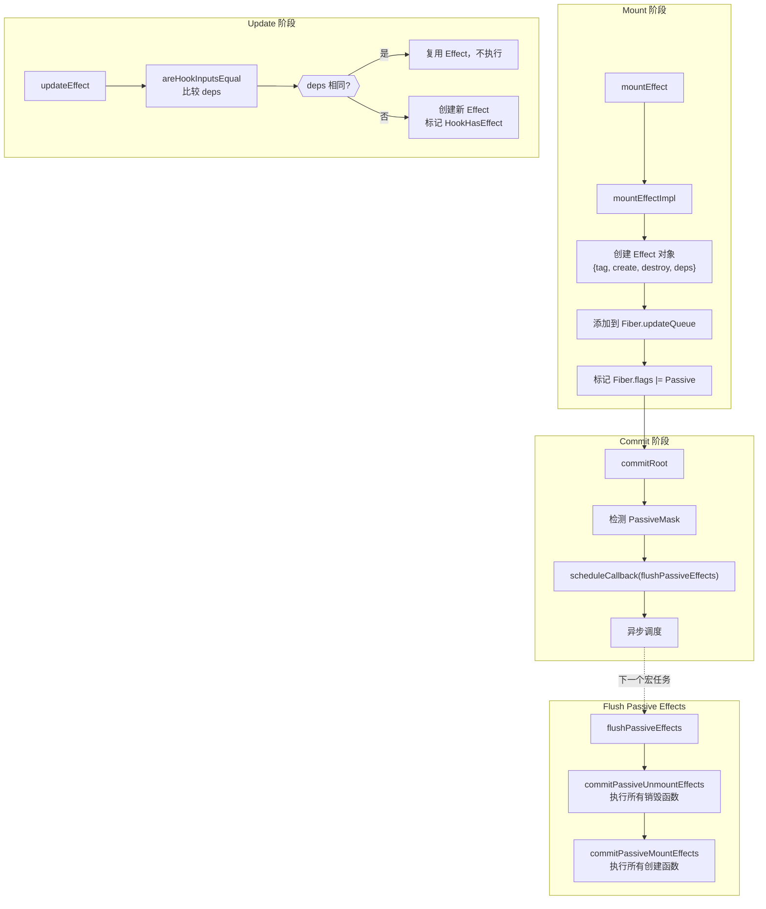
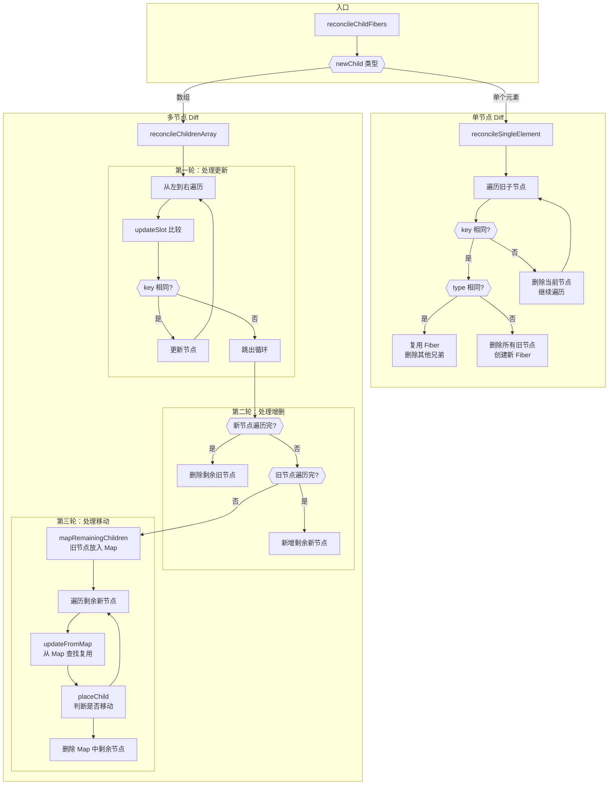
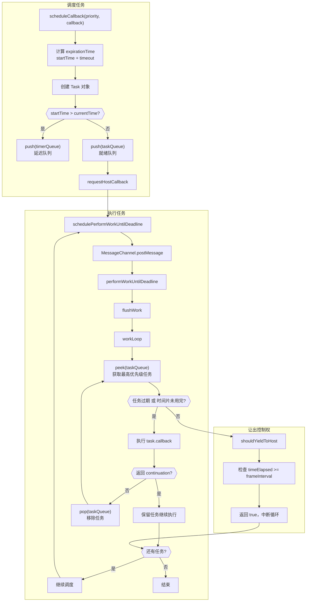
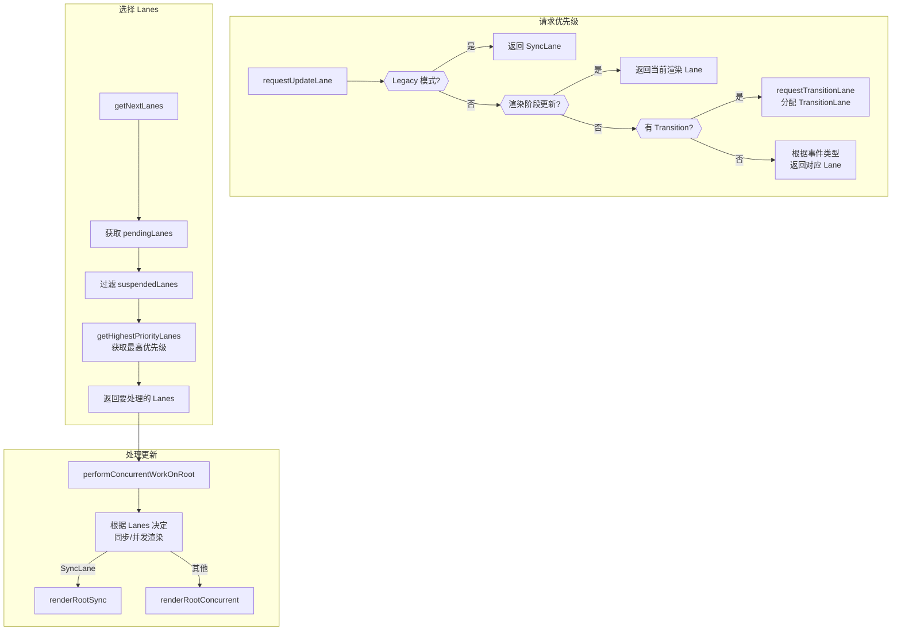
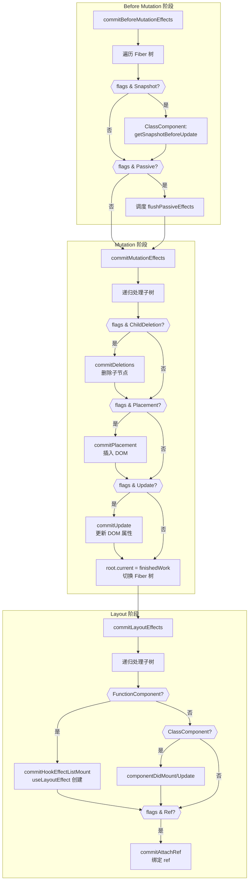
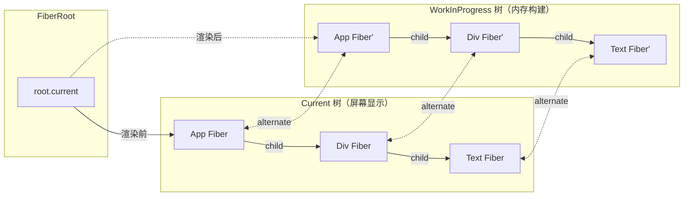

# React 19 渲染流程图

## 一、整体架构

## 二、完整渲染流程

## 三、Fiber 树遍历顺序

## 四、useState 更新流程

## 五、useEffect 执行流程

## 六、Diff 算法流程

## 七、Scheduler 调度流程

## 八、Lane 优先级处理

## 九、Commit 三阶段详细流程

## 十、双缓冲机制

---

## 调试建议

1. **入口断点**：`ReactDOM.createRoot` → `createRoot` → `createFiberRoot`
2. **更新断点**：`dispatchSetState` → `scheduleUpdateOnFiber`
3. **渲染断点**：`performUnitOfWork` → `beginWork` → `completeWork`
4. **提交断点**：`commitRoot` → `commitMutationEffects` → `commitLayoutEffects`

在 Counter 组件点击按钮时，可以完整观察从 `dispatchSetState` 到 DOM 更新的全流程。
